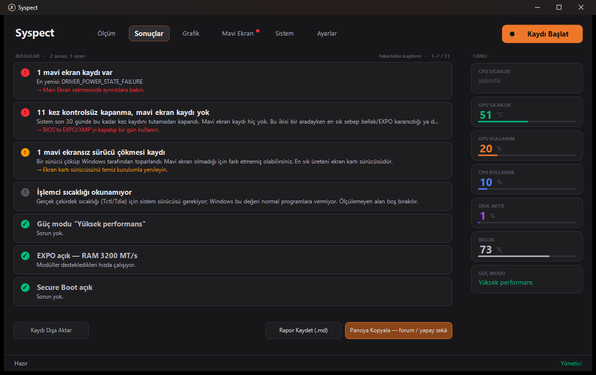

# Syspect

**Oyunda takılıyorsa sebebini söyler.**

Windows oyun kararlılık teşhis aracı. Takılmaların, donmaların ve mavi
ekranların sebebini bulup **sebep + güven oranı + tek cümlelik aksiyon**
olarak sunar.

Bu bir izleme aracı değil. PresentMon, LatencyMon ve HWiNFO zaten mükemmel
veri topluyor — hepsi kullanıcıya grafik verip yorumu ona bırakıyor. Hedef
kitle o grafiği okuyamayan kişi. Syspect'in işi veri toplamak değil, **hüküm
vermek**.

[](https://github.com/VS-57/syspect/actions/workflows/ci.yml)



---

## İndir

[**Son sürüm →**](https://github.com/VS-57/syspect/releases/latest) ·
Windows 10/11 · kurulum yok · ücretsiz

Zip'i açıp `ss_ui.exe` çalıştırmak yeterli. Kurulum yapmaz, kayıt defterine
dil ve tema tercihiniz dışında bir şey yazmaz.

> **Windows bir uyarı gösterecek.** Program şu an imzasız dağıtılıyor.
> *Daha fazla bilgi* → *Yine de çalıştır*. Güvenmiyorsanız sürüm notundaki
> SHA-256 özetlerini karşılaştırın, VirusTotal taramasına bakın ya da kaynak
> koddan kendiniz derleyin.
>
> Yayınlanan paketler [GitHub Actions tarafından](.github/workflows/release.yml)
> etiketli commit'ten derleniyor; derleme günlüğü herkese açık.

**İşinize yaradıysa bir ⭐ bırakırsanız sevinirim.** Projenin görülmesine
yarıyor; başka bir karşılığı yok.

---

## Her sonuç üç parçadan oluşur

| | |
|---|---|
| **Sebep** | On sekiz ayrı sebep sıralanır: bellek kararsızlığı, sürücü, güç kaynağı, depolama, darboğaz… |
| **Güven** | Hiçbir sebep %80'i geçemez. Kalan pay açıkça "ölçemediğimiz alan" diye yazılır. |
| **Aksiyon** | Tek cümle. "Şunu deneyebilirsin, ya da şunu" değil; sıradaki tek adım. |

---

## Emin olmadığında susar

Yanlış teşhis bu projenin bir numaralı riski: kullanıcı çalışan bir sürücüyü
kaldırabilir ya da gereksiz donanım alabilir. Dört ayrı fren var.

**Yetersiz veriyle hüküm verilmez.** 30 saniyenin altındaki ölçümde
istatistikler gösterilir, sebep sıralaması yapılmaz. Düşük güvenle üretilmiş
bir liste, altına eklenen uyarıya rağmen kesin bilgi gibi okunur.

**Tek sebep tavanı %80.** "Kesin sebep bu" cümlesi hiçbir koşulda kurulmaz.

**Geçmişteki olay ile şu anki olay ayrılır.** İki ay önce bir kez ekran
sürücüsü sıfırlanmış sağlıklı bir makine, bugünkü takılması için suçlanmaz.
Ölçümle çakışan olay **sinyaldir**, yalnızca geçmişte duran olay **bağlamdır**.

**Okunamayan şey "sorun yok" sayılmaz.** Ölçülemeyen her alan ayrıca
listelenir; sessizce atlanmaz.

---

## Ne yapmaz

- **Oyununuza dokunmaz.** Hook yok, DLL enjeksiyonu yok, oyun belleğine okuma
  yok. Yalnızca Windows'un kendi yayınladığı ölçüm olayları pasif dinlenir.
  Anti-cheat sınırı bilerek hiç zorlanmaz.
- **Hiçbir ayarınızı değiştirmez.** Ne yapmanız gerektiğini söyler, sizin
  yerinize yapmaz.
- **Veri toplamaz.** Telemetri yok, hesap yok, kimlik yok. Disk seri numarası
  bile bilerek okunmuyor. Tek ağ isteği sürüm denetimi, o da kapatılabilir.
- **Kendini güncellemez.** İmzasız binary + yönetici hakkı, otomatik
  güncelleyici için mümkün olan en kötü bileşim.

---

## Mimari: taşınabilir beyin, Windows kabuk

`core.h` **hiçbir Windows API'sine bağımlı değildir.** Takılma tespiti ve
teşhis mantığı saf C++. Motor Linux'ta derlenip sentetik verilerle test
edilebiliyor; Windows'a özgü veri toplama (ETW, WMI, PDH, olay günlüğü,
SMBIOS, IOCTL) ayrı katmanda kalıyor ve `SignalSnapshot` / `SystemInfo`
yapılarını doldurup veriyor.

| Katman | Dosya |
|---|---|
| Teşhis motoru (taşınabilir) | `core.cpp` |
| Kare kaynağı — kendi ETW oturumumuz | `etw_frame_source.cpp` |
| DPC suçlusu — çekirdek ETW + modül tablosu | `dpc_source.cpp` |
| Telemetri — NVML, PDH, WMI | `telemetry.cpp` |
| Sistem yoklaması — SMBIOS, güç planı, firmware | `system_probe.cpp` |
| Depolama envanteri + SMART | `storage_probe.cpp` |
| Olay günlüğü — WHEA, KP41, TDR, depolama | `event_log.cpp` |
| Mavi ekran okuyucu (`PAGEDU64`) | `dumpreader.cpp` |
| Bulgu listesi | `findings.cpp` |
| Arayüz — Win32 + GDI+, harici bağımlılık yok | `ss_ui.cpp` |
| Dil katmanı — `lang/*.lang` | `i18n.cpp` |

---

## Derleme

```bash
cmake -B build -DCMAKE_BUILD_TYPE=Release
cmake --build build --config Release
ctest --test-dir build --output-on-failure
```

MSVC'de statik CRT (`/MT`) otomatik seçilir — kullanıcıdan VC++
Redistributable istenmez. Arayüz harici bağımlılık kullanmaz.

Sürüm paketi:

```bash
tools/release.ps1
```

Testler geçmeden paket üretmez. Bu bir kolaylık değil kilit: vaka
külliyatının kırıldığı bir sürüm, yanlış teşhis dağıtmak demektir.

---

## Komut satırı

```bash
ss_cli capture --seconds=120     # canlı ETW yakalama (yönetici)
ss_cli analyze trace.csv         # PresentMon CSV'si oku
ss_cli eventlog                  # olay günlüğü dökümü
ss_cli storage                   # disk envanteri ve SMART
ss_cli dpc --seconds=20          # DPC dökümü (yönetici)
```

---

## Test paketi = vaka külliyatı

`test_core.cpp` içindeki senaryolar **gerçek forum şikâyetlerinden**
türetilmiştir. Yeni bir kural eklendiğinde hepsi doğru hükmü vermeye devam
etmelidir.

| Senaryo | Beklenen hüküm | Ayırt edici sinyal |
|---|---|---|
| CPU-yoğun anlarda takılma | Sürücü DPC | tek `.sys` olayların %40+'ında |
| Monitör değişiminden sonra | VRR / kare zamanlama | mikro-takılmalar **düzenli** aralıklı |
| Dump üretmeyen sert donma | Bellek / EXPO | WHEA + Kernel-Power 41, bugcheck yok |
| Opera'da da takılıyor | Undervolt / CO | takılma **oyun dışında** da var |
| Düşük FPS, düzenli | Donanım yetersiz | takılma **yok**, dağılım dar |
| Power Brake + ani kapanma | Güç kaynağı | PSU'nun GPU'ya frenleme sinyali |
| İlk 10 dakikada yoğun | Shader derlemesi | sonra kayboluyor — **normal** |
| Farklı hızda RAM modülleri | Karışık takım | modül başına test bu durumu **elemez** |
| Az veri | "Bilmiyorum" | motor hüküm vermeyi **reddediyor** |

Son satır en önemlisi.

---

## Bilinen sınırlar

- **CPU çekirdek sıcaklığı (Tctl/Tdie) okunamıyor.** Ring 0 gerektiriyor;
  `RDMSR` ayrıcalıklı bir komut ve Windows onu kullanıcı-mod sürece veremez.
  Uydurma değer üretilmiyor.
- **Kısıtlama sebebi okunamıyor.** Intel PL1/PL2, PROCHOT ve AMD PPT/TDC/EDC
  donanım tarafından özerk uygulanıyor ve Windows'a görünmüyor.
- **Güç kaynağı transient'leri ölçülemez.** Mikrosaniye mertebesinde.
- **AMD GPU telemetrisi yok.** ADLX entegrasyonu bekliyor; NVIDIA kartlarda
  NVML kullanılıyor.
- **Kernel sürücüsü yok.** EV sertifika maliyeti nedeniyle v1.0'a ertelendi.

---

## Katkı

**Kod katkısı şu anda kabul edilmiyor**; pull request'ler birleştirilmiyor.
Telif hakkı tek elde tutuluyor ve düzgün bir telif devri (CLA) süreci
kurulana kadar dışarıdan kod alınamıyor — devri imzalanmamış tek bir katkı,
projenin ileride farklı bir lisansla yayınlanabilmesini kalıcı olarak
imkânsız kılar.

Bunun yerine değerli olanlar: **yanlış teşhis bildirimi**, **gerçek vaka +
`.syscap` kaydı**, **çeviri**. Ayrıntı: [CONTRIBUTING.md](CONTRIBUTING.md)

Fork yapıp kendi sürümünüzü dağıtmakta serbestsiniz; AGPL bunu açıkça
veriyor.

---

## Lisans

**AGPL-3.0** — [LICENSE](LICENSE)

Kullanmak serbest. Değiştirip dağıtırsanız ya da ağ üzerinden hizmet olarak
sunarsanız kaynağını aynı lisansla açmak zorundasınız.

Telif hakkı tek elde; AGPL koşulları size uymuyorsa **ticari lisans** için
iletişime geçin. Ayrıntı: [NOTICE.md](NOTICE.md)

Üçüncü parti bileşen lisansları: [LICENSES.txt](LICENSES.txt)

---

Bir [EnUcuzSistem](https://enucuzsistem.com) aracı.
